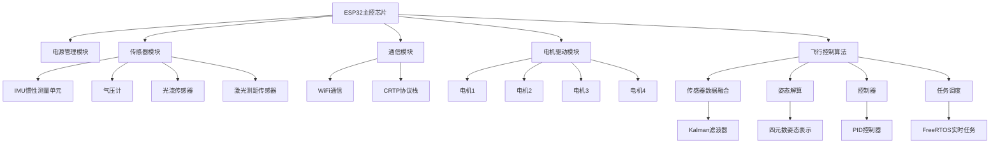

# ESP-Drone 项目总结

## 1. 项目文件目录结构

```
ESP-Drone/
├── Firmware/                         # 固件相关文件
│   └── esp-drone/                    # ESP-Drone固件源代码
│       ├── build/                    # 编译生成文件目录
│       ├── components/               # 项目组件目录
│       │   ├── config/               # 配置相关代码
│       │   ├── core/                 # 核心功能代码（基于Crazyflie）
│       │   ├── drivers/              # 驱动程序
│       │   │   ├── deck/             # 扩展板驱动
│       │   │   ├── general/          # 通用驱动（电机、LED等）
│       │   │   ├── i2c_bus/          # I2C总线驱动
│       │   │   ├── i2c_devices/      # I2C设备驱动（MPU6050、HMC5883L等）
│       │   │   └── spi_devices/      # SPI设备驱动
│       │   ├── lib/                  # 库文件
│       │   └── platform/             # 平台相关代码
│       ├── main/                     # 主程序入口
│       └── README.md                 # 固件说明文档
├── Hardware/                         # 硬件相关文件
│   ├── Intractive bom/               # 交互式物料清单
│   └── production/                   # 生产制造文件
└── README.md                         # 项目主说明文档
```

### 各目录和文件功能说明

- **Firmware/esp-drone/components/core/**: 核心飞控功能，包括姿态估计、稳定控制、命令处理等
- **Firmware/esp-drone/components/drivers/**: 硬件驱动程序，支持MPU6050、电机PWM控制、WiFi通信等
- **Firmware/esp-drone/components/platform/**: 平台相关代码，包括ESP32平台初始化
- **Firmware/esp-drone/main/**: 程序入口点，包含main函数
- **Hardware/**: 包含电路图、PCB设计文件、生产制造文件等

## 2. 无人机制作指南

### 所需器件清单

1. **主控芯片**：
   - ESP32模块（如ESP-WROOM-32）

2. **传感器**：
   - MPU6050 6轴陀螺仪加速度计模块

3. **动力系统**：
   - 核心电机（空心杯电机） x4
   - 塑料螺旋桨 x4

4. **电源系统**：
   - 锂电池（通常为1S 3.7V，如300-500mAh）

5. **结构件**：
   - PCB主板（根据项目提供的PCB文件制作）
   - 电机支架
   - 螺丝等紧固件

6. **其他**：
   - 电阻、电容等基础电子元件
   - 连接器、导线等

### 制作流程

#### 1. 硬件制作
1. 根据项目提供的原理图和PCB文件制作PCB板
2. 焊接所有电子元件，包括ESP32、MPU6050、电阻、电容等
3. 安装电机和螺旋桨
4. 组装机架结构

#### 2. 软件准备
1. 搭建ESP-IDF开发环境
2. 克隆或下载项目源代码
3. 根据需要配置项目（使用`idf.py menuconfig`）
4. 编译固件（使用`idf.py build`）

#### 3. 固件烧录
项目提供了两种烧录方式：

##### 方式一：使用ESP-IDF工具链
```bash
idf.py build
idf.py flash
```

##### 方式二：使用ESP32 Flash Download Tool
烧录时需要以下文件和地址：
- 0x1000 bootloader.bin
- 0x8000 partition-table.bin  
- 0x10000 ESPDrone.bin

#### 4. 调试与测试
1. 连接电源，检查各模块是否正常工作
2. 使用手机连接ESP-Drone创建的WiFi热点
3. 通过WiFi控制无人机进行试飞
4. 根据飞行表现进行PID参数调优

### 控制方式
ESP-Drone通过WiFi创建热点，用户可以使用手机连接到该热点并通过专门的应用程序或网页界面控制无人机。系统接收控制指令后，通过MPU6050获取当前姿态信息，结合控制指令进行姿态解算和PID控制，最终输出PWM信号控制四个电机的转速，实现飞行控制。

## 系统架构原理图



## 系统启动流程图

```
flowchart TD
    A[系统上电] --> B[NVS Flash初始化]
    B --> C[平台初始化]
    C --> D[系统任务启动]
    D --> E[系统任务初始化]
    E --> F[WiFi初始化]
    E --> G[系统负载监控初始化]
    E --> H[调试接口初始化]
    E --> I[CRTP协议初始化]
    E --> J[控制台初始化]
    E --> K[配置块初始化]
    E --> L[工作队列初始化]
    E --> M[ADC初始化]
    E --> N[LED序列初始化]
    E --> O[电源管理初始化]
    E --> P[蜂鸣器初始化]
    E --> Q[应用程序初始化]
    
    Q --> R[通信初始化]
    Q --> S[指令解析初始化]
    Q --> T[状态估计器初始化]
    Q --> U[控制器初始化]
    Q --> V[声音模块初始化]
    Q --> W[内存管理初始化]
    
    U --> X[自检测试]
    X --> Y{自检通过?}
    Y -->|是| Z[系统启动完成]
    Y -->|否| AA[LED错误指示]
```

## 飞行控制主循环流程图

```
flowchart TD
    A[稳定器任务开始] --> B[等待系统完全启动]
    B --> C[等待传感器校准完成]
    C --> D[初始化循环计数器]
    D --> E[速率监控初始化]
    E --> F[主循环开始]
    F --> G[等待传感器数据就绪]
    G --> H{是否进行螺旋桨测试?}
    H -->|是| I[执行螺旋桨测试]
    H -->|否| J[状态估计]
    J --> K[获取控制指令]
    K --> L[SitAw更新设定点]
    L --> M[控制器计算]
    M --> N[检查紧急停止]
    N --> O{紧急停止或未解锁?}
    O -->|是| P[停止电机]
    O -->|否| Q[功率分配到电机]
    Q --> R[计算传感器到输出延迟]
    R --> S[增加循环计数器]
    S --> F
```

## 主要实现难点分析

### 1. 实时性保障

ESP-Drone作为一个实时控制系统，最大的挑战之一是保证系统的实时性：

- **高频率控制循环**：稳定器循环需要以1kHz的频率运行，这对ESP32的处理能力提出了很高要求
- **任务优先级调度**：系统中包含多个任务（传感器读取、状态估计、控制计算、通信等），需要合理分配优先级
- **中断处理延迟**：传感器数据采集依赖于精确的中断处理，任何延迟都可能影响飞行稳定性

### 2. 传感器数据融合

精确的状态估计是飞行控制的基础，项目采用了复杂的传感器融合算法：

- **Kalman滤波器实现**：项目使用基于论文的Kalman滤波器进行传感器融合，实现位置、速度、姿态的精确估计
- **多传感器同步**：IMU、气压计、光流传感器、激光测距传感器等多种传感器的数据需要精确同步
- **噪声处理**：不同传感器具有不同的噪声特性和误差模型，需要针对性处理

### 3. 姿态解算与控制算法

四轴飞行器的稳定飞行依赖于精确的姿态解算和控制：

- **四元数运算**：为了避免欧拉角的万向锁问题，系统使用四元数表示姿态，增加了计算复杂度
- **PID控制器调参**：需要针对不同的飞行模式和负载情况进行参数调整
- **坐标系转换**：需要在机体坐标系和世界坐标系之间进行频繁转换

### 4. 硬件平台适配

从STM32平台移植到ESP32平台带来了额外的挑战：

- **外设驱动适配**：需要重新实现I2C、SPI、PWM等外设驱动
- **RTOS差异处理**：虽然都使用FreeRTOS，但ESP-IDF的实现与原平台存在差异
- **内存管理优化**：ESP32的内存资源相比STM32更为有限，需要更精细的内存管理

### 5. 通信协议实现

项目需要实现复杂的通信协议栈：

- **CRTP协议**：Crazyflie Radio Protocol的完整实现
- **WiFi通信优化**：在保证实时性的同时利用WiFi的高带宽优势
- **数据包处理**：需要高效处理大量不同类型的通信数据包

### 6. 系统稳定性与安全性

作为飞行器系统，稳定性和安全性至关重要：

- **异常处理机制**：需要完善的看门狗、堆栈溢出检测等机制
- **故障安全模式**：在传感器失效或通信中断时能够安全降落
- **参数保护**：关键飞行参数需要保护和验证机制

## 总结

ESP-Drone项目是一个复杂而精密的嵌入式实时控制系统，涉及硬件驱动、实时操作系统、传感器融合、控制理论等多个技术领域。其主要难点在于如何在资源受限的ESP32平台上实现高实时性、高精度的飞行控制，同时保证系统的稳定性和安全性。成功解决这些技术难点将为开源无人机社区提供一个具有重要价值的参考实现。